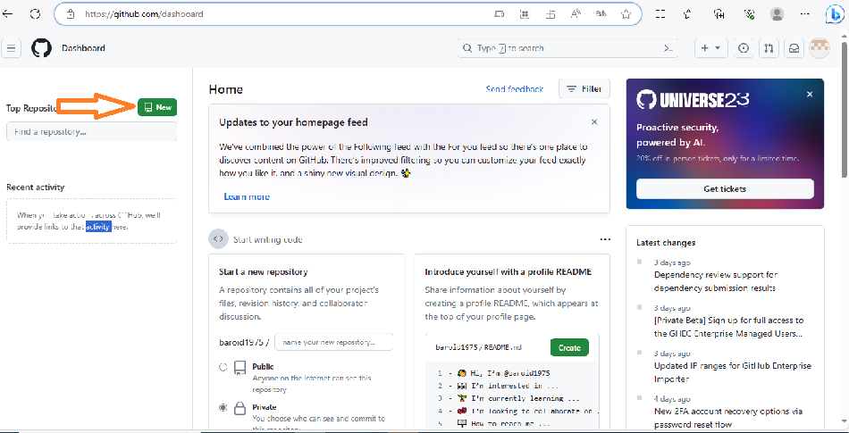
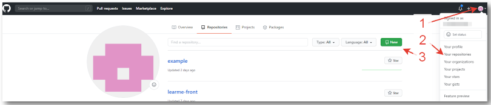

[< к содержанию](./readme.md)

# GitHub

Git работает, позволяя нам сделать снимок текущего состояния всех файлов в папке нашего проекта. Каждый раз, когда мы сохраняем один из этих снимков, мы делаем коммит Git. Затем цикл запускается снова, и Git создает новые снэпшоты, показывая, как выглядел наш проект в любой момент.

Общий рабочий процесс для создания фиксации Git для сохранения разных моментальных снимков состоит из следующих шагов:
Измените содержимое папки нашего проекта.
Внесите или отметьте изменения, которые мы хотим сохранить в нашей следующей фиксации.
Зафиксируйте или сохраните изменения навсегда в базе данных Git нашего проекта.
Как упоминается в третьем шаге, Git использует специальную базу данных, называемую репозиторием. 

 ## Что такое коммит GitHub
 ***GitHub*** на сегодняшний день является наиболее популярным хостингом *IT*-проектов. На *GitHub* хранятся миллионы удалённых репозиториев, как небольших команд, так и крупных корпораций.
 Веб-сервис основан на системе контроля версий *Git* и запущен компанией *GitHub*, Inc в 2008 году. С 2018года и по настоящее время владельцем GitHub является *Microsoft*.

 

----
Особенностью *GitHub* является лёгкое создание форков и  осуществляется посредством нажатия  одной кнопки. 

### Регистрация на github.com
---
Для регистрации на *github.com*git:

1. Перейдите по ссылке https://github.com/.
2. Выберите *«Sign up»*.
3. Заполните информацию.
4. Нажмите кнопку *«Create account»*.
5. Войдите в почту и подтвердите почтовый адрес.

### Создание проекта на github.com
---
Для создания репозитория на *GitHub* нажмите на кнопку *«new»*, которая находится на главной странице в верхнем левом углу.

 
 Создание репозитория на *GitHub* c главной страницы

Создание репозитория на *GitHub* cо   страницы со списком репозитариев