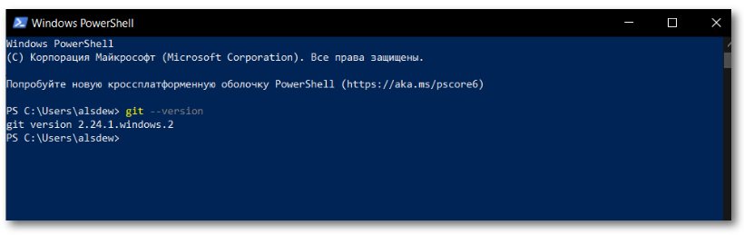
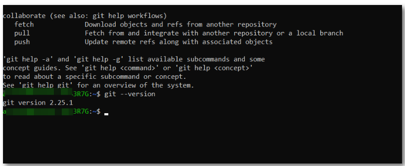

[< к содержанию](./readme.md)

# Установка GIT

## Установка GIT в Windows

Проверка наличия *GIT*:
> git - version

Если на вашем компьютере уже установлен *GIT*, в этом случае отобразится версия: 

Для установки GIT необходимо перейти по ссылке: https://git-scm.com/download/win, скачать подходящий дистрибутив и следовать указанным инструкциям.

## Установка GIT в LInux Ubuntu (CLI apt)

Проверка наличия *GIT*:
> $ git -- version

Также необходимо выполнить команду в терминале:
> $ sudo apt install git

